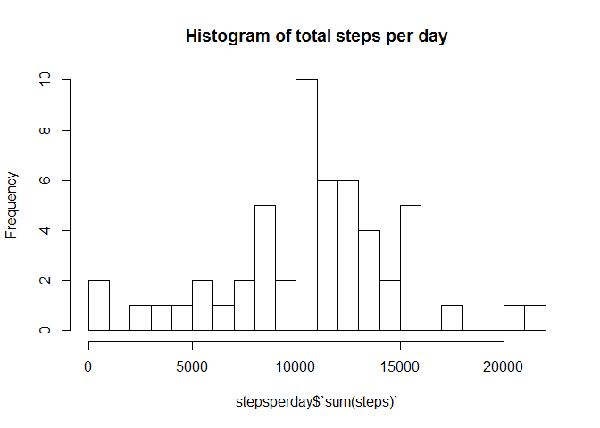
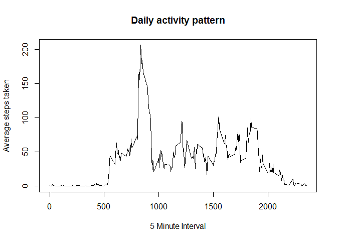
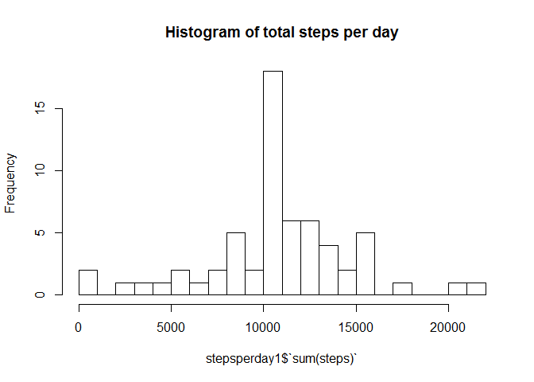
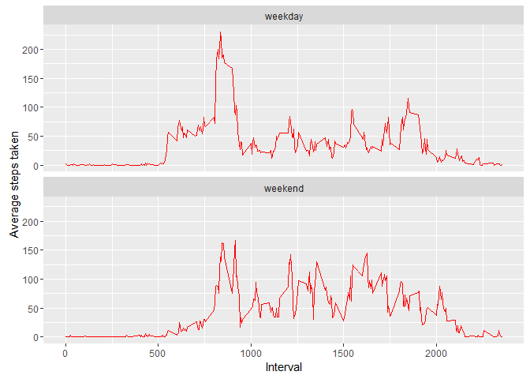

*Roshni Sharma*
---------------

### *12 Dec 2016*

    knitr::opts_chunk$set(echo = TRUE)

Introduction
------------

This is an R Markdown document of [Coursera](http://www.coursera.com/)
"Reproducible Research" course week 2 assignment 1.This is a peer
assessment. This assignment makes use of data from a personal activity
monitoring device. This device collects data at 5 minute intervals
through out the day. The data consists of two months of data from an
anonymous individual collected during the months of October and
November, 2012 and include the number of steps taken in 5 minute
intervals each day.

The entire assignment in a single R markdown document that can be
processed by knitr and be transformed into an HTML file. Markdown is a
simple formatting syntax for authoring HTML, PDF, and MS Word documents.
For more details on using R Markdown see <http://rmarkdown.rstudio.com>.

When you click the **Knit** button a document will be generated that
includes both content as well as the output of any embedded R code
chunks within the document. You can embed an R code chunk like this:

Preparing R environment
-----------------------

Including libraries required

    library(ggplot2)
    library(data.table)
    library(dplyr)

    ## -------------------------------------------------------------------------

    ## data.table + dplyr code now lives in dtplyr.
    ## Please library(dtplyr)!

    ## -------------------------------------------------------------------------

    ## 
    ## Attaching package: 'dplyr'

    ## The following objects are masked from 'package:data.table':
    ## 
    ##     between, last

    ## The following objects are masked from 'package:stats':
    ## 
    ##     filter, lag

    ## The following objects are masked from 'package:base':
    ## 
    ##     intersect, setdiff, setequal, union

Loading and preprocessing data
------------------------------

This assignment makes use of data from a personal activity monitoring
device. This device collects data at 5 minute intervals through out the
day. The data consists of two months of data from an anonymous
individual collected during the months of October and November, 2012 and
include the number of steps taken in 5 minute intervals each day.

This assigment needs to show any code that is needed to

1.Load the data

2.Process/transform the data (if necessary) into a format suitable for
your analysis

Data can be downloaded from
[here](https://d396qusza40orc.cloudfront.net/repdata%2Fdata%2Factivity.zip)

Note - Assuming current working directory has the the file downloaded

Checking data summary of file in the forked repository

    activitydata <- read.csv("activity.csv")
    summary(activitydata)

    ##      steps                date          interval     
    ##  Min.   :  0.00   2012-10-01:  288   Min.   :   0.0  
    ##  1st Qu.:  0.00   2012-10-02:  288   1st Qu.: 588.8  
    ##  Median :  0.00   2012-10-03:  288   Median :1177.5  
    ##  Mean   : 37.38   2012-10-04:  288   Mean   :1177.5  
    ##  3rd Qu.: 12.00   2012-10-05:  288   3rd Qu.:1766.2  
    ##  Max.   :806.00   2012-10-06:  288   Max.   :2355.0  
    ##  NA's   :2304     (Other)   :15840

What is mean total number of steps taken per day?
-------------------------------------------------

For this part of the assignment, you can ignore the missing values in
the dataset.

*1.Calculate the total number of steps taken per day 2.If you do not
understand the difference between a histogram and a barplot, research
the difference between them. Make a histogram of the total number of
steps taken each day*

    stepsperday <- summarise(group_by(activitydata, date),sum(steps))
    hist(stepsperday$`sum(steps)`, breaks = 25, main = "Histogram of total steps per day")

*3.Calculate and report the mean and median of the total number of steps
taken per day*

     m <- mean(stepsperday$`sum(steps)`, na.rm= TRUE)
     mm <- median(stepsperday$`sum(steps)`, na.rm= TRUE)

The mean is 1.076618910^{4} and median 10765

What is the average daily activity pattern?
-------------------------------------------

*1.Make a time series plot of the 5-minute interval (x-axis) and the
average number of steps taken, averaged across all days (y-axis)*

     meansteps <- summarise(group_by(activitydata, interval),mean(steps,na.rm= TRUE))
     plot(meansteps$interval, meansteps$`mean(steps, na.rm = TRUE)`, type = "l", xlab = "5 Minute Interval", ylab = "Average steps taken", main = "Daily activity pattern")

*2.Which 5-minute interval, on average across all the days in the
dataset, contains the maximum number of steps?*

    max_meansteps <- which.max(meansteps$`mean(steps, na.rm = TRUE)`)
    m3 <- meansteps[max_meansteps,]

835th interval contains maximum 206.1698113 number of steps

Imputing missing values
-----------------------

\*Note that there are a number of days/intervals where there are missing
values.The presence of missing days may introduce bias into some
calculations or summaries of the data. 1.Calculate and report the total
number of missing values in the dataset

    missing_vals <- sum(is.na(activitydata$steps))

the total number of missing values are 2304

*2.Devise a strategy for filling in all of the missing values in the
dataset. The strategy does not need to be sophisticated. For example,
you could use the mean/median for that day, or the mean for that
5-minute interval, etc.*

To populate missing values the mean of that day for that 5 - minute
interval is chosen. Create *na\_rows* to have all row numbers with na
values.

    na_rows <- which(is.na(activitydata$steps))

Create *na\_replace* to have all values that need to be replaced with.

    na_replace <- unlist(lapply(na_rows,FUN = function(x) {
      intervalval <- activitydata[x,]$interval
      fillval <- meansteps[meansteps$interval == intervalval,]$`mean(steps, na.rm = TRUE)`
    }))

*3.Create a new dataset that is equal to the original dataset but with
the missing data filled in.* Then we fill all values in the data set
that has na.

    activitydata1<- activitydata
    activitydata1[na_rows,]$steps <- na_replace

Check

    str(activitydata1)

    ## 'data.frame':    17568 obs. of  3 variables:
    ##  $ steps   : num  1.717 0.3396 0.1321 0.1509 0.0755 ...
    ##  $ date    : Factor w/ 61 levels "2012-10-01","2012-10-02",..: 1 1 1 1 1 1 1 1 1 1 ...
    ##  $ interval: int  0 5 10 15 20 25 30 35 40 45 ...

NOw we Check for na.

    sum(is.na(activitydata1$steps))

    ## [1] 0

*4.Make a histogram of the total number of steps taken each day and
Calculate and report the mean and median total number of steps taken per
day.*

    stepsperday1 <- summarise(group_by(activitydata1, date),sum(steps))
    hist(stepsperday1$`sum(steps)`, breaks = 25, main = "Histogram of total steps per day")

*Calculate and report the mean and median of the total number of steps
taken per day*

     m1 <- mean(stepsperday1$`sum(steps)`, na.rm= TRUE)
     mm1 <- median(stepsperday1$`sum(steps)`, na.rm= TRUE)

The mean is 1.076618910^{4} and median 1.076618910^{4}

*Do these values differ from the estimates from the first part of the
assignment?*

Earlier - The mean is 1.076618910^{4} and median 10765

Afterfill - The mean is 1.076618910^{4} and median 1.076618910^{4}

*What is the impact of imputing missing data on the estimates of the
total daily number of steps?*

    The mean has not changed but there is sligh difference in median which has moved median towards mean. which is understandable because of our fill strategy.The histogram shows there are more values at the peak but no other change in distribution.

Are there differences in activity patterns between weekdays and weekends?
-------------------------------------------------------------------------

*For this part the weekday function may be of some help here. Use the
dataset with the filled-in missing values for this part. 1.Create a new
factor variable in the dataset with two levels - "weekday" and "weekend"
indicating whether a given date is a weekday or weekend day.*

     activitydata1$weekdayname <- ifelse(weekdays(as.Date(activitydata1$date))=="Saturday" | weekdays(as.Date(activitydata1$date))=="Sunday", "weekend", "weekday")
      
      weekdays <- activitydata1 %>% group_by(weekdayname, interval) %>% summarise(mean.steps=mean(steps))

*2.Make a panel plot containing a time series plot of the 5-minute
interval (x-axis) and the average number of steps taken, averaged across
all weekday days or weekend days (y-axis). See the README file in the
GitHub repository to see an example of what this plot should look like
using simulated data.*

    meanstepsbyweekdays <- activitydata1 %>% group_by(weekdayname, interval) %>% summarise(mean.steps=mean(steps))
      ggplot(meanstepsbyweekdays, aes(x=interval, y= mean.steps))+ geom_line(color = "red")+facet_wrap(~ weekdayname, nrow=2, ncol=1)+labs(x="Interval",y="Average steps taken")

We can see more walking in weekday one peak whereas in weekend it is
distributed across with lesser height in peak.
